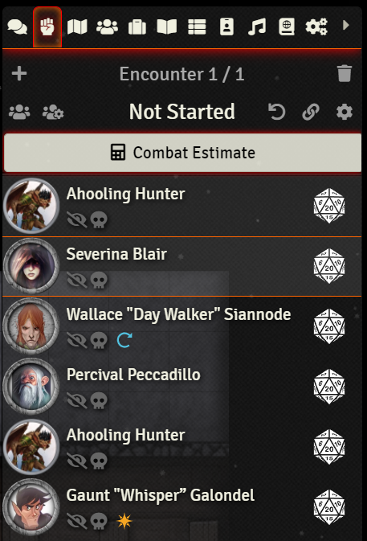
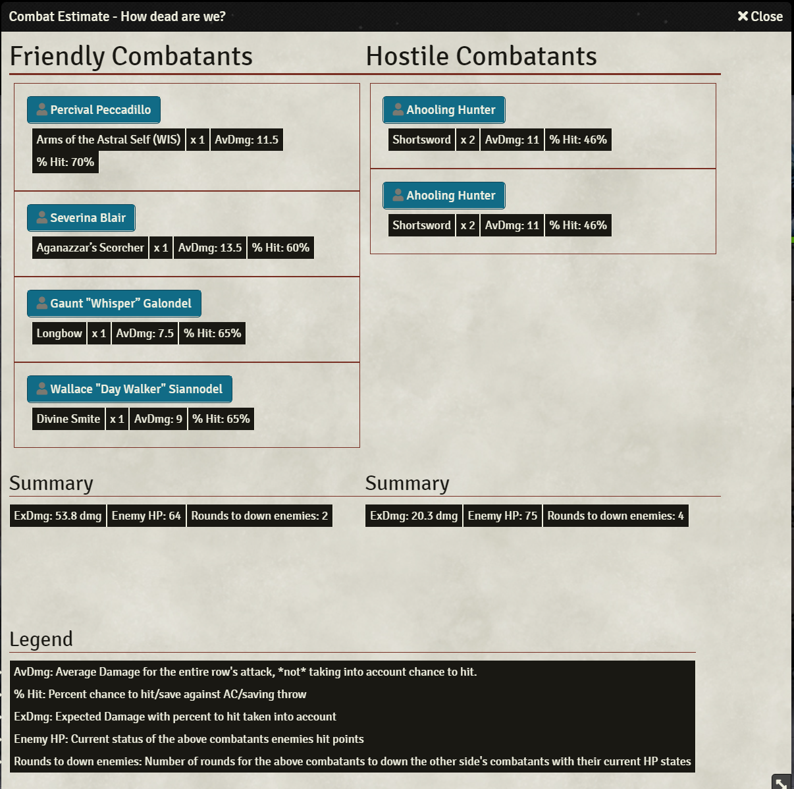

<!--- Downloads @ Latest Badge -->
<!--- replace <user>/<repo> with your username/repository -->
<!---  -->

<!--- Forge Bazaar Install % Badge -->
<!--- replace <your-module-name> with the `name` in your manifest -->
<!---  -->

# How to Combat-Estimate

1. Create a combat on your scene
2. Open the combat blade on the side bar
3. Click Combat Estimate

4. Profit! That's really it! The dialog should load very quickly and display a rough estimate of how much damage each creature will do on each attack if it hits, as well as how likely they are to hit against enemy armor classes/saving throws (still a work in progress).

## Current Limitations and planned work: 

1. Calculating saving throws
1. Applying resistances
1. Legendary actions
1. Lair actions
1. Player class features: Great weapon master, sharpshooter, sneak attack, etc. 