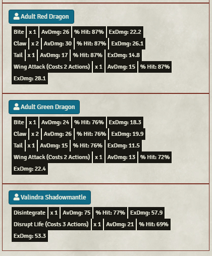

<!--- Downloads @ Latest Badge -->
<!--- replace <user>/<repo> with your username/repository -->

<!--- Forge Bazaar Install % Badge -->
<!--- replace <your-module-name> with the `name` in your manifest -->

# NOTE: This module's functionality has been folded into Stochastic Fantastic. Please download [this](https://foundryvtt.com/packages/dnd-randomizer) module instead ([Github](https://github.com/etriebe/dnd-randomizer)). 

# How to use Combat-Estimate

1. Create a combat on your scene
2. Open the combat blade on the side bar
3. Click Combat Estimate

4. Profit! That's really it! The dialog should load very quickly and display a rough estimate of how much damage each creature will do on each attack if it hits, as well as how likely they are to hit against enemy armor classes (Saving throws are still a work in progress).

## Legendary Actions

V1 support for calculating legendary actions is out! This will even determine for legendary actions like a Dragon's Wing Attack, which isn't classified as an area-of-effect attack by Foundry, determine how many enemies you're likely to hit just based on the size of the effect. 

## Supported Features

1. Multi-attack/extra attack for non-player character creatures & players with classes
2. Calculating saving throw percentage chance at failure
3. Half-damage on save
4. Damage immunities, resistances and vulnerabilities 
5. Legendary actions

## Current Limitations and planned work: 

1. Lair actions
2. Player class features: Great weapon master, sharpshooter, etc. 
3. Taking into account active spell slots
4. Having a "conserve resources" / "go all out" mode. 